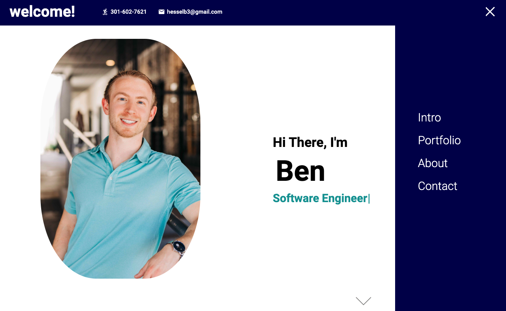
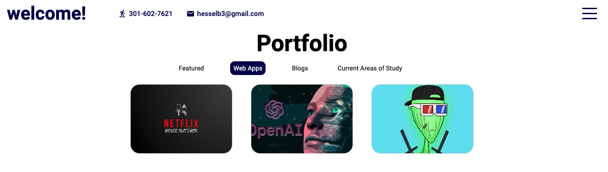

<h1 align="center">Personal Portfolio site</h1>

    

<h3 align="center"><a href="https://benhessel.herokuapp.com/">** Click to Visit Deployed Site **</a></h3>

## Description

Welcome to my personal portfolio site! 

I'll continue to update this over time as I build new projects, write new blog posts, and accomplish new things throughout my career.

## Preview
There are four sections to the site right now:  
- Intro
- Projects + blog posts
- (A little) About Me
- Contact

Snap/smooth scroll perfectly aligns each section.

The (navbar) hamburger collapses on sidebar open/close.

You can sort through/display featured projects and blog posts. 

## Technologies
- React/JavaScript
- [SCSS](https://sass-lang.com/)
- [Heroku](https://herokuapp.com) - for deployment
- [EmailJS](https://www.emailjs.com/)
- [Typewriter Effect](https://www.npmjs.com/package/typewriter-effect)